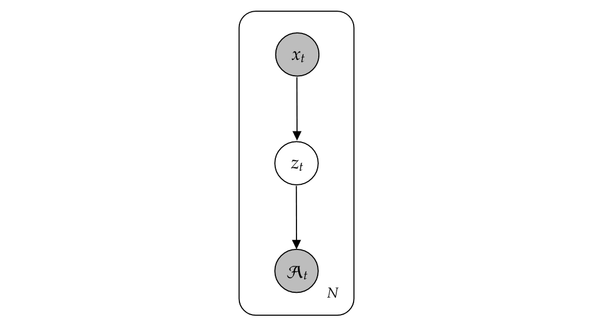
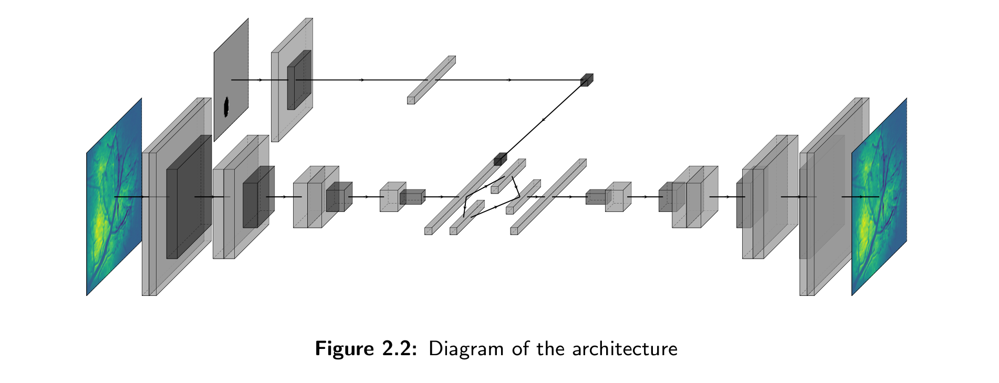
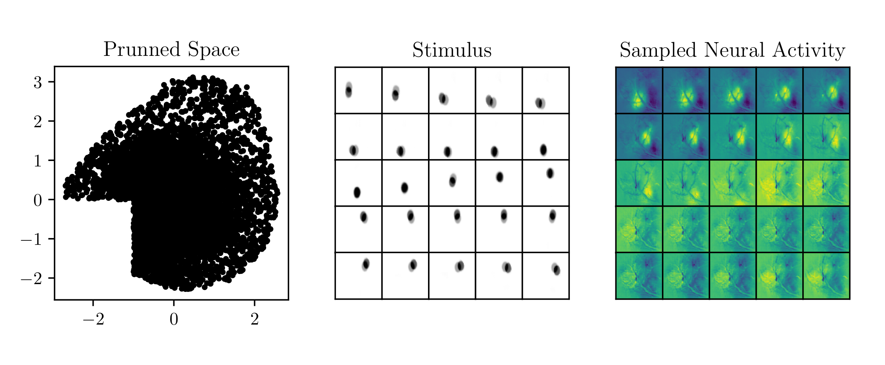

# Variational Inference

This repo contains the code used to perform **variational** inference in the
following graphical model:

The model is implemented in PyTorch and for the logs the wandb library is
needed.

### Plots

### References

* Auto-Encoding Variational Bayes, Diederik P Kingma, Max Welling.
